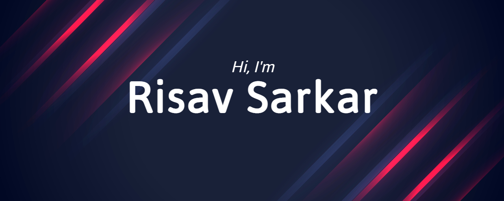

  

- 🌱 I’m currently learning ... React.js and DSA!
- ⚡ Fun fact: Love to play video games 🎮

## 📫 How to reach me:

 
    
    
    
    
    

## 👨‍💻 Tech Stack I am Familiar With

 
        
        
        
        
        
        
        

